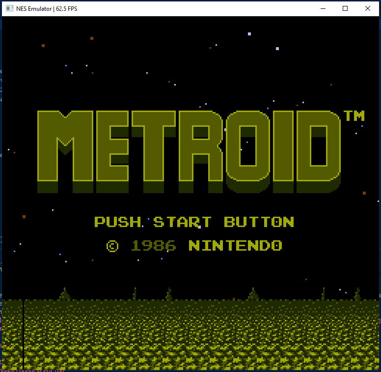
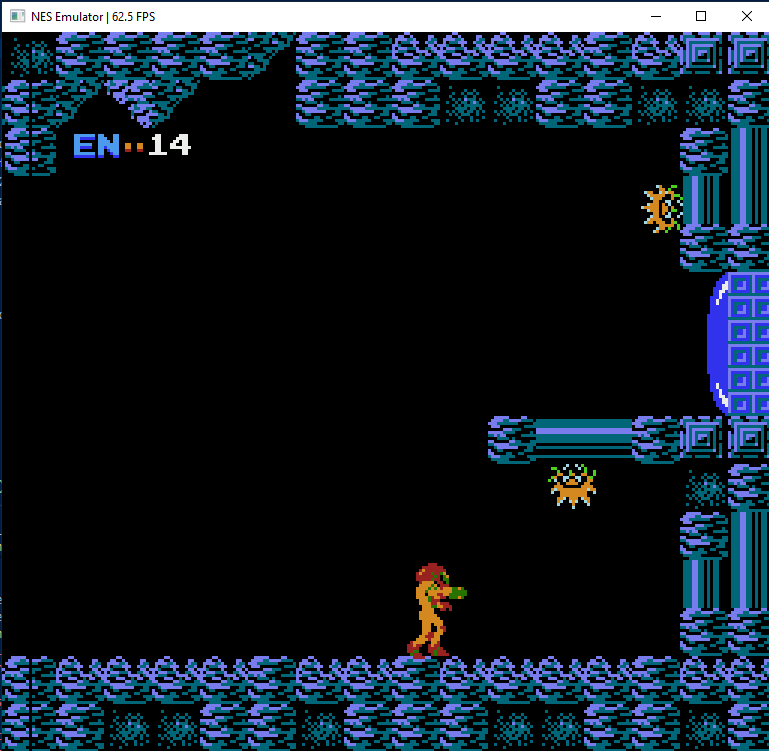
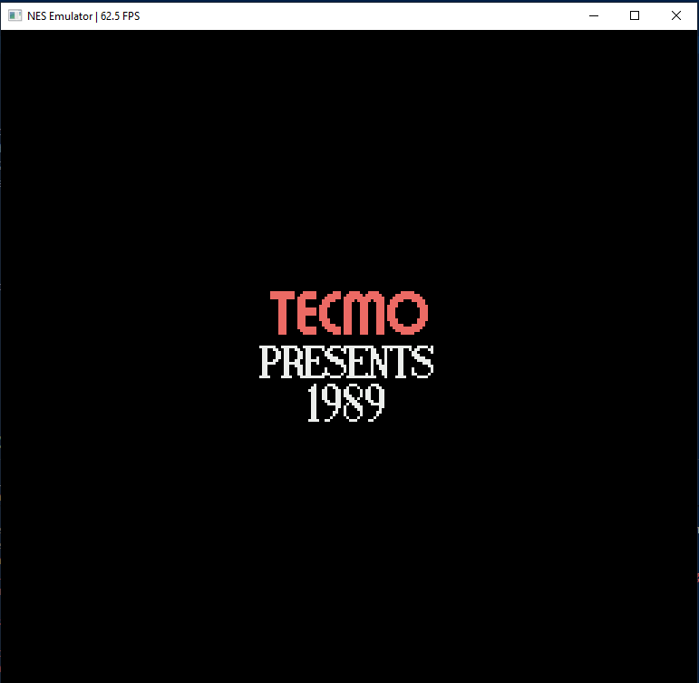
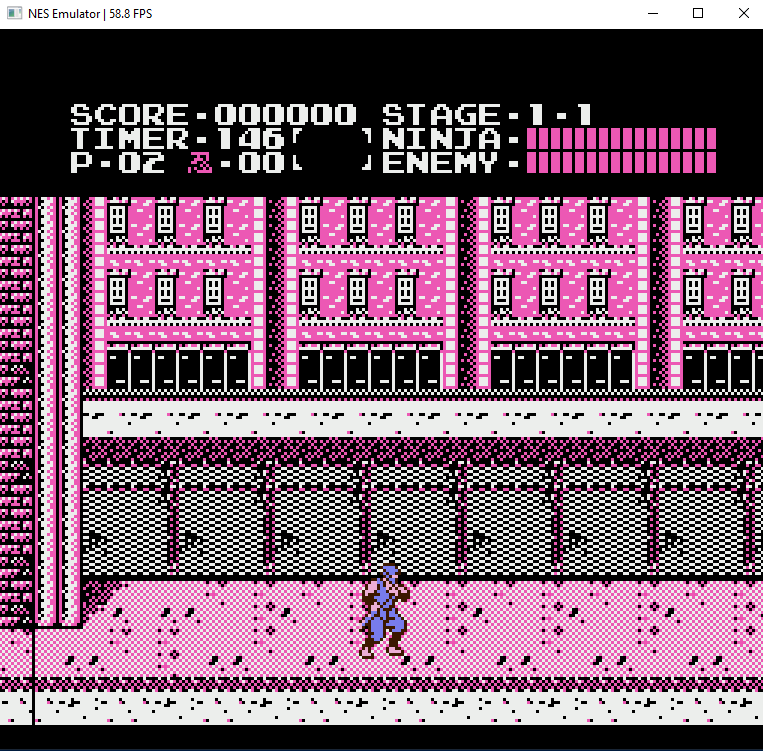
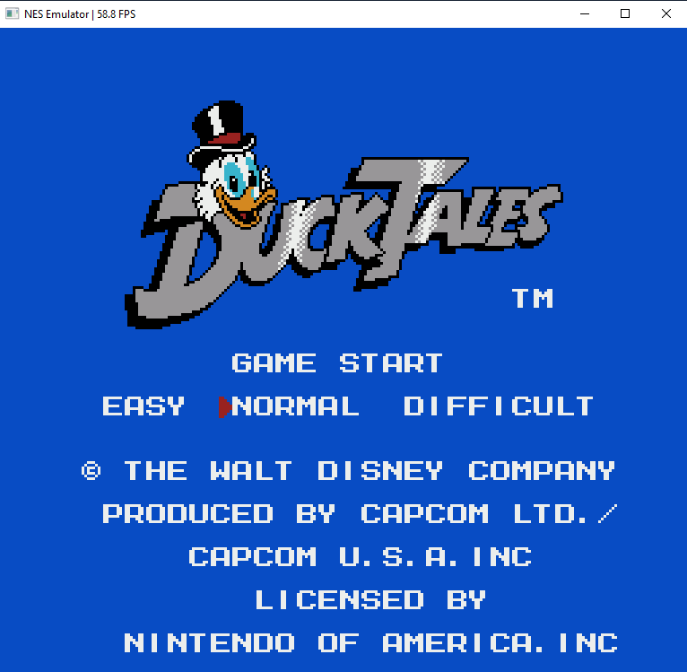
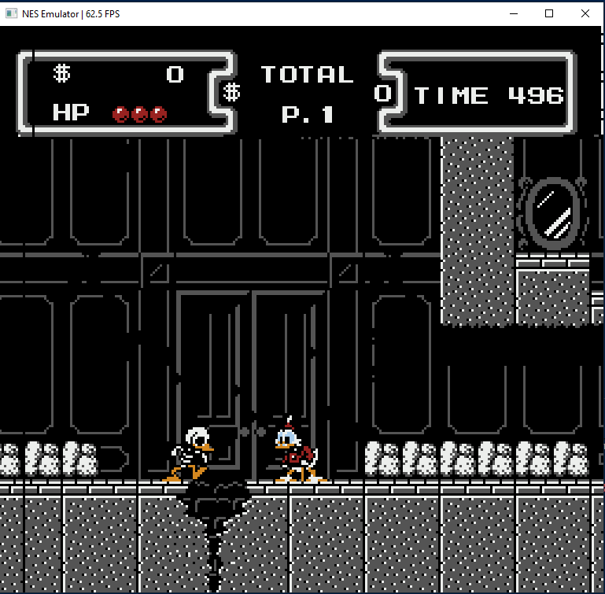

<div align="center">

# NESEmu

### Emulador de Nintendo Entertainment System (NES)

[](https://en.wikipedia.org/wiki/C_(programming_language))
[](https://www.libsdl.org/)
[](#)

---

</div>

## Screenshots

<div align="center">






</div>

---

## Sobre

O NESEmu é um emulador de Nintendo Entertainment System desenvolvido em linguagem C, utilizando SDL2 para renderização gráfica e entrada de dados. O projeto foi criado com fins educacionais, visando o estudo de arquitetura de computadores e sistemas emulados.

---

## Funcionalidades

- CPU 6502 completa com todos os modos de endereçamento
- PPU com renderização de fundo e sprites
- Suporte a mappers 0, 1, 2, 3 e 4 (MMC1, MMC3)
- Controle via teclado e gamepad para dois jogadores
- Captura de tela em formato BMP

---

## Pré-requisitos

| Dependência | Versão Mínima |
|-------------|---------------|
| Compilador C (GCC, Clang ou MSVC) | Qualquer versão recente |
| SDL2 | 2.0+ |
| Make (opcional) | GNU Make |

---

## Instalação

### Linux / macOS

```bash
git clone https://github.com/Developer-Vini/NESEmu.git
cd NESEmu
make
./nes_emulator caminho/para/rom.nes
```

### Windows (MSYS2 / MinGW)

```bash
git clone https://github.com/Developer-Vini/NESEmu.git
cd NESEmu
make
nes_emulator.exe caminho\para\rom.nes
```

### Compilação Manual

```bash
gcc -O2 -Wall -Iinclude -o nes_emulator \
    src/main.c src/cpu.c src/ppu.c src/bus.c \
    src/cartridge.c src/palette.c \
    $(sdl2-config --cflags --libs) -lm
```

---

## Controles

**Jogador 1:**

| Tecla | Função |
|-------|--------|
| Z | A |
| X | B |
| Enter | Start |
| Shift Direito | Select |
| Setas | D-Pad |

**Jogador 2:**

| Tecla | Função |
|-------|--------|
| Q | A |
| W | B |
| 1 | Start |
| 2 | Select |
| T / G / F / H | Cima / Baixo / Esquerda / Direita |

**Geral:**

| Tecla | Função |
|-------|--------|
| R | Reset |
| P | Screenshot |
| ESC | Sair |

---

## Estrutura do Projeto

```
NESEmu/
├── include/
│   ├── bus.h
│   ├── cartridge.h
│   ├── cpu.h
│   ├── nes.h
│   └── ppu.h
├── src/
│   ├── bus.c
│   ├── cartridge.c
│   ├── cpu.c
│   ├── main.c
│   ├── palette.c
│   └── ppu.c
├── screenshots/
├── .gitignore
├── Makefile
└── README.md
```

---

## Arquitetura

```
         +---------------------+
         |      Main Loop      |
         +----------+----------+
                    |
    +---------------+---------------+
    |               |               |
    v               v               v
+-------+     +-----------+     +-------+
| Input |     |    CPU    |     |  PPU  |
+-------+     |    6502   |     +-------+
              +-----+-----+
                    |
                    v
              +-----------+
              |    Bus    |
              +-----+-----+
                    |
                    v
              +-----------+
              | Cartridge |
              +-----------+
```

---

## Mappers Suportados

| Mapper | Nome | Exemplos de Jogos |
|--------|------|-------------------|
| 0 | NROM | Super Mario Bros, Donkey Kong |
| 1 | MMC1 | Metroid, Legend of Zelda |
| 2 | UxROM | Mega Man, Castlevania |
| 3 | CNROM | Gradius, Arkanoid |
| 4 | MMC3 | Super Mario Bros 3, Kirby's Adventure |

---

## Licença

Este projeto é para fins educacionais.

---

<div align="center">

Feito por [Vinicius](https://github.com/Developer-Vini)

</div>
